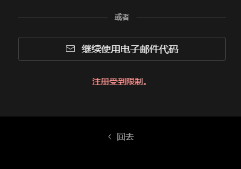
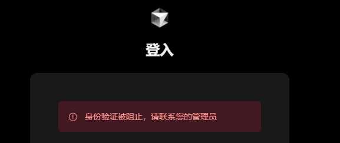
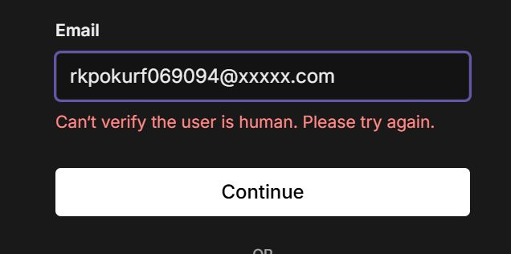
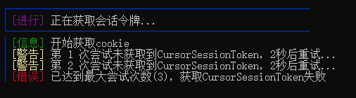

# Cursor_Change_ID_Auto

## 🌟 重要提示
> 本程序由开源脚本思路整合，感谢各位Github以及各大论坛的大佬无私奉献！
>
> 本工具完全免费，不进行任何收费
>
> 获取最新版本请加入QQ群：631250950

> 不直接发布在Github原因已经很明了，防止被倒卖。国内的开源环境就这样，差得很

## 🚀 最新更新 v6.0.0
- 新增支持 Cursor v0.45.x 版本
- 优化界面显示和用户体验
- **优化整体注册速度**
- **新增自动获取UA**
- **新增浏览器随机指纹（加强）**
- **新增自动清理验证码邮件功能**
- **新增自动登录重试获取令牌功能（新）**
- 改进邮箱验证码获取逻辑
- 增强系统稳定性和兼容性
- 修复已知问题和bug

## 📋 功能特性
1. **自动注册功能**
   - 自动生成随机账号信息
   - 自定义邮箱域名
   - 浏览器随机指纹
   - 自动获取UA
   - 自动处理人机验证
   - 自动获取验证码
   - 自动清理验证码邮件
   - 自动替换旧账户
   
2. **ID修改功能**
   - 支持自动修改机器码
   - 自动备份原有配置
   - 支持禁用自动更新
   - 兼容多系统平台

3. **邮箱支持**
   - 支持 IMAP 邮箱配置
   - 支持自定义域名邮箱
   - 多种邮箱验证方式

## 💻 系统要求
- Windows/macOS/Linux 系统
- 已安装 Google Chrome 浏览器
- 稳定的网络连接

## ⚙️ 配置说明
1. **环境配置**
   - 确保已安装 Chrome 浏览器
   - 确保系统时间正确
   - 确保网络连接稳定

2. **.env 文件配置(不使用自动注册可以不用配置)**
   
   ```ini
   # 代理 一般不需要，如果需要请使用软件的代理
   # BROWSER_PROXY='http://127.0.0.1:2080' 
   
   # 无头模式
   BROWSER_HEADLESS='False' # True为启用 False为不启用
   
   # 验证设置
   TURNSTILE_TIMEOUT=20     # Turnstile 验证超时时间（秒）
   VERIFICATION_CODE_TIMEOUT=180  # 验证码邮件有效期（秒），默认3分钟
   
   # 是否自动清理所有 Cursor 邮件（避免堆积太多验证码邮件）
   CLEAN_ALL_CURSOR_MAILS='False'  # True为启用 False为不启用
   
   # Cloudflare 域名邮箱地址 (必填)
   # 需要把自己的域名挂到 Cloudflare 并且设置邮件路由规则
   DOMAIN=xxxxx.com 
   
   # IMAP邮箱配置（必填）
   # 推荐使用QQ邮箱
   IMAP_SERVER=imap.qq.com    # IMAP服务器地址
   IMAP_PORT=993              # IMAP端口，SSL通常为993
   IMAP_USER=xxx@qq.com       # 邮箱地址
   IMAP_PASS=xxx              # 邮箱授权码或密码
   # IMAP_DIR=                # [可选] 默认为收件箱(inbox)
   ```

## 🚀 使用说明

### Windows

```
右击 Yan_cursor_Change_ID_Auto.exe，使用管理员权限运行
```


### Linux / Mac

```
chmod +x Yan_cursor_Change_ID_Auto
sudo ./Yan_cursor_Change_ID_Auto
```
>  mac用户你的CPU是ARM也就是苹果的CPU的请使用ARM版本，Intel的请使用X86-64版本
>
>  QQ群发送【怎么运行】获取更详细的启动教程

1. **首次使用**
   - 运行程序会自动创建 .env 文件
   - 请按照.env里的注释配置
   - 确保.env里所有配置填写是正确的
2. **注册流程**
   - 获取UA，并且随机生成浏览器指纹
   - 程序会自动生成随机账号
   - 自动填写注册信息
   - 自动处理验证码
   - 完成注册后会自动替换旧账号
3. **ID修改**
   - 自动备份原有配置
   - 生成新的机器码
   - 更新系统配置
   - 禁用自动更新

## ❗ 常见问题
1. **验证码获取失败**
   - 检查邮箱配置是否正确
   - 确认网络连接是否稳定
   - 尝试更换QQ邮箱或其他稳定的邮箱
2. **浏览器相关问题**
   - 确保 Chrome 浏览器已正确安装
   - 检查浏览器版本是否兼容
   - 尝试更新浏览器版本
   - 有谷歌浏览器还报错可以尝试重装谷歌浏览器
3. **注册失败问题** [推荐节点18.9 1000G 无限时高速节点（需要梯子打开）](https://赔钱机场.com/#/register?code=pv9jL8nc)
   - 检查网络连接
   - 确认配置文件正确
   - 查看错误提示信息
4. **人机验证过不去** [推荐节点18.9 1000G 无限时高速节点（需要梯子打开）](https://赔钱机场.com/#/register?code=pv9jL8nc)
   - 检查网络环境手动注册是否能过去
   - 更换网络环境
   - 开启或关闭代理以及更换节点
5. **注册受到限制** [推荐节点18.9 1000G 无限时高速节点（需要梯子打开）](https://赔钱机场.com/#/register?code=pv9jL8nc)
   - 检查网络环境手动注册是否能过去
   - 更换网络环境
   - 开启或关闭代理以及更换节点
   - 使用群里的geek删除谷歌浏览器，在用群里的谷歌浏览器安装器重新安装谷歌浏览器


## ✅新功能已经解决的问题

1. **随机浏览器指纹** （解决`注册受到限制`和`身份认证被阻止`）
   

   

2. **自定义UA** （解决`人机认证过不去问题`）
   

3. **自动登录重试获取令牌**（解决`自动注册令牌获取失败，导致自动替换旧账户失败`）
   


## 🔒 安全提示
- 请勿将.env配置文件分享给他人
- 妥善保管注册的账号信息

## 🆘 获取帮助
- 遇到问题请加入QQ群：631250950
- 获取最新版本请加群下载
- 技术支持请联系群主
- 提供详细的错误信息和截图

## 📝 免责声明
1. 本工具仅供学习和研究使用
2. 请勿用于任何商业用途
3. 使用本工具所产生的一切后果由使用者自行承担
4. 如有侵权请联系我们删除

## 🎯 更新计划
- [ ] 暂无，你有什么好的建议吗？

## 💌 联系方式
- QQ群：631250950
- 获取最新版本请加群下载
- 技术交流请加群联系群主

## 🎁 打赏与交流
> 如果觉得工具好用，可以请作者喝杯咖啡，同时加入QQ群获取更多技术支持！

| 微信收款码 | 支付宝收款码 | QQ群邀请码 |
|:---------:|:-----------:|:---------:|
|  |  |  |
| 微信打赏 | 支付宝打赏 | QQ群：631250950 |

## ⭐ 特别说明
1. 本工具完全免费，谨防受骗
2. 定期关注更新，及时获取新功能
3. 欢迎加群交流使用心得
4. 感谢大家的支持和反馈
5. [推荐节点18.9 1000G 无限时高速节点（需要梯子打开）](https://赔钱机场.com/#/register?code=pv9jL8nc)

---
**文档最后更新时间：2025-02-12 22:00**

**脚本更新在群里通知，上面只是文档**

_如果觉得好用，请推荐给身边的朋友，一起加入QQ群：631250950_ 